# MindSense

##  Grup 184 AI Takım Üyeleri

- **Fatma Ceren Çil** – Scrum Master  
- Seydi Dağlı  
- Yusuf Tetik  
- Aybüke Yıldız  
- Hamide Arslan  - Product Owner


<details>
<summary><strong> Proje Tanımı</strong></summary>


MindSense, ilkokul ve ortaokul düzeyindeki öğrencilerin dijital ortamda bireysel ders çalışmasını destekleyen; yapay zekâ destekli, yazılı ve sesli etkileşime açık, duygusal durum farkındalığı yüksek bir eğitim platformudur.

Uygulama, öğrencinin seçtiği konularda etkileşimli olarak soru sorar ve öğrencinin verdiği cevapları yazılı veya sesli olarak analiz eder. Eğer öğrenci, öfke, üzüntü, kaygı, stres veya depresyon gibi olumsuz duygular taşıyorsa, sistem öncelikle öğrenciye uygun destekleyici yanıtlar üretir. Eğer bu durum devam ediyorsa veya risk düzeyi artıyorsa, ilgili okulun rehberlik servisine otomatik uyarı sistemi üzerinden bildirim gönderir.

MindSense, öğrenci performansını sadece akademik açıdan değil, psikolojik refah açısından da izleyen, Türkiye'de geliştirilen hibrit (eğitim + rehberlik destekli) yapay zekâ tabanlı okul içi rehberlik bildirim sistemine sahip eğitim teknolojisidir. Bu yönüyle bireysel farklılıklara saygı duyar, öğrencinin duygusal sesini dijital ortamda görünür kılar.

Uygulama, yapay zekâyı sadece bilgi üretiminde değil, aynı zamanda duygu analizi, rehberlik entegrasyonu ve otomatik yönlendirme mekanizması ile sosyal fayda yaratacak biçimde kullanır.


</details>

<details>
<summary><strong> Proje Özellikleri </strong></summary>

 **Konu Bazlı Dijital Etkileşim:**  
  Öğrenci, öğrenmek istediği dersi ve konuyu platform üzerinde seçer. Uygulama, konuya özel olarak yapılandırılmış soru–yanıt döngüsü başlatır.

- **Yapay Zekâ Destekli Öğrenme:**  
  LLM (Large Language Model) altyapısı ile öğrencinin verdiği yanıtlar değerlendirilir. Yanıtlara göre detaylı geri bildirimler ve takip soruları sunulur.

- **Duygu Analizi (Emotion Analysis):**  
  Öğrencinin verdiği yazılı veya sesli yanıtlar, DistilBERT Emotion modeli ile analiz edilir. Duygular (üzgün, öfkeli, stresli, kararsız vb.) sınıflandırılır.

- **Destekleyici Yanıtlar:**  
  Öğrencinin duygusal durumuna göre, pozitif geri bildirimler, motivasyon mesajları ve stres azaltıcı öneriler sistem tarafından otomatik olarak sunulur.

- **Rehberlik Sistemi Uyarı Mekanizması:**  
  Öğrencinin duygusal risk durumu eşik değeri aştığında, sistem bu durumu rehber öğretmen ekranına bildirim olarak iletir.

- **Sesli Yanıt ve Ses Tanıma:**  
  Öğrenci isterse mikrofon ile konuşarak da yanıt verebilir. Sistem bu sesi yazıya dönüştürüp analiz eder ve sesli yanıtla geri döner.

- **Farklı Rol ve Ekranlar:**  
  - **Öğrenci Paneli:** Konu seçimi, yanıt alanı, sesli yanıt butonları  
  - **Rehber Öğretmen Paneli:** Bildirimler, öğrenci duygu geçmişi ve müdahale seçenekleri  


- **Veri Güvenliği ve Loglama:**  
  Tüm analizler anonimleştirilmiş şekilde kayıt altına alınır. Kullanıcı verileri şifrelenerek saklanır.

- **Gelişmiş Geri Bildirim Motoru:**  
  Sistem, öğrencinin hem doğru–yanlış yanıtlarını hem de duygusal durumunu birleştirerek yönlendirmeleri buna göre üretir.

</details>

<details>
<summary><strong> Proje Amacı ve Kapsamı</strong></summary>

**Amaçlar:**
- Öğrencilerin bireysel öğrenme deneyimini iyileştirmek
- Cevaplardan duygusal durum tespiti yapmak
- Rehberlik birimlerine erken uyarı sistemleri sunmak

**Kapsam:**
- AI destekli soru–cevap mekanizması
- Yazılı ve sesli yanıtların duygusal analizi
- Rehber öğretmen bildirim sistemi
- Web arayüzü (Streamlit ile)
- Sesli iletişim modülü (girdi ve çıktı)
- Gelişmiş loglama ve kullanım analitiği

</details>


<details>
<summary><strong> Kullanıcı Rolleri</strong></summary>

| Rol               | Açıklama                                                                 |
|------------------|--------------------------------------------------------------------------|
| Öğrenci          | Sisteme giriş yaparak chatbot üzerinden ders çalışır ve analiz edilir.  |
| Rehber Öğretmen  | Riskli durumlarda öğrencilerle ilgili bildirim alır ve takip yapar.      |
| Sistem Yöneticisi| Kullanıcı yönetimi ve genel sistem kontrolünü sağlar.                    |
| Geliştirici      | Yazılım altyapısını geliştirir ve sistem entegrasyonlarını yürütür.      |
</details>


<details>
<summary><strong> Hedef Kitle</strong></summary>

- İlkokul, ortaokul düzeyindeki öğrenciler  
- Rehber öğretmenler ve okul psikolojik danışmanları  
- Eğitim kurumları (resmî veya özel)  
- Uzaktan eğitim sistemleri  
- Eğitim teknolojileri alanında çalışan geliştiriciler

</details>

<details>
<summary><strong> Kullanıcı Senaryoları (User Story)</strong></summary>

### Öğrenci (Primary User)
- Derse başlamadan önce duygusal durumumu analiz eden bir sistem kullanmak istiyorum ki sistem bana uygun bir içerik ve yaklaşım sunabilsin.
- Her ders için ayrı ayrı asistanla konuşmak istiyorum ki dersi daha iyi kavrayabileyim.
- Sorduğum sorulara yazılı ve sesli cevaplar alabilmek istiyorum ki anlamadığım noktaları daha net anlayabileyim.
- Asistanın beni anlamadığını hissettiğimde tekrar açıklamasını isteyebileyim ki öğrenme sürecim kesintiye uğramasın.

### Öğretmen
- Öğrencilerimin sistemdeki etkileşimlerini görmek istiyorum ki kimlerin desteğe ihtiyacı olduğunu anlayabileyim.
- Öğrencinin verdiği yanıtların hangi konularda eksik olduğunu görebilmek istiyorum ki bireysel destek sağlayabileyim.

### Rehber Öğretmen / Psikolojik Danışman
- Riskli duygusal duruma sahip öğrencilere ilişkin bildirim almak istiyorum ki erken müdahale edebileyim.
- Sistem tarafından analiz edilen duygusal durum geçmişini görebilmek istiyorum ki öğrencinin gelişimini uzun vadede izleyebileyim.

### Sistem Yöneticisi / Geliştirici
- Kullanıcı rollerini yönetebilmek istiyorum ki öğrenci, öğretmen ve danışmanlara uygun haklar verebileyim.
- Sistem loglarını takip edebilmek istiyorum ki sorun çıktığında hızlıca müdahale edebileyim.
- Kullanıcıdan gelen metni duygu analizine gönderen bir API yazmak istiyorum ki her mesajda öğrencinin ruh hali anlaşılabilsin.
</details>


<details>
<summary><strong> Kullanılan Teknolojiler</strong></summary>

## Kullanılan Teknolojiler

Tüm teknolojiler ücretsiz açık kaynaklıdır veya ücretsiz kullanım kontenjanı dahilindedir.

### Genel Teknoloji Tablosu

| Katman / Alan        | Teknoloji / Araçlar                    | Açıklama |
|----------------------|----------------------------------------|----------|
| Backend              | FastAPI                                | Python tabanlı hızlı ve modern web çatısı |
| Frontend             | Streamlit (veya Gradio)                | Web tabanlı etkileşimli kullanıcı arayüzü |
| Veritabanı           | PostgreSQL               | Kullanıcı ve içerik verilerinin saklanması |
| LLM (Yanıt Üretimi)  | Ollama – Gemma 3B (lokal), Gemini 1.5 Pro (bulut) | Chatbot yanıtları ve yönlendirme önerileri |
| Duygu Analizi (NLP)  | HuggingFace – DistilBERT Emotion       | Öğrenci metinlerinden duygu durumu tahmini |
| Ses Tanıma (STT)     | OpenAI Whisper veya Vosk               | Öğrenci sesli yanıtlarının metne dönüştürülmesi |
| Sesli Yanıt (TTS)    | gTTS, Tortoise TTS                     | Chatbot yanıtlarının sese dönüştürülmesi |
| Bildirim Sistemi     | E-posta API, Admin Panel               | Rehber öğretmene uyarı gönderme mekanizması |
| Loglama              | JSON formatında kayıt (timestamp + duygu + metin) | Öğrenci etkileşim geçmişi ve analiz raporları |
| Hosting / Deployment | Vercel (Frontend), Render (Backend)    | Projenin canlı ortama aktarılması |
| Proje Yönetimi       | Miro, GitHub Projects                  | Scrum yönetimi, sprint planlaması |
| Sürüm Kontrolü       | Git + GitHub                           | Kod versiyonlama ve takım içi iş birliği |


</details>
<details>
  <summary><strong> Miro Link </strong></summary>
  https://miro.com/welcomeonboard/SEw5bGFBK1pLZ1R4a050QnBsSk9Wc0R6WXN0clpoemt4M25zTW1YdUJuV3FSNnFnNDM3bUxmMkNQRW1BbS9aNHZZQTZmL1NlNXJ6ZFU4R0RhelhtRGRDK3V4S2N5UE05MC9haWVBZmJQWXk4TS9KbG16MHJyTTVjS3VpM3JIVEphWWluRVAxeXRuUUgwWDl3Mk1qRGVRPT0hdjE=?share_link_id=888493269890
</details>
<details>
<summary><strong>Product Backlog</strong></summary>

MindSense, öğrencilerin duygusal durumlarına duyarlı bir yapay zekâ destekli eğitim platformudur. Bu Product Backlog, Scrum metodolojisine uygun şekilde tüm iş paketlerini, kullanıcı ihtiyaçlarını ve teknik modülleri kapsamaktadır.


##  Product Backlog Tablosu

| ID | İş Kalemi | Öncelik | Açıklama |
|----|-----------|----------|-----------|
| PB-01 | Proje fikrinin netleştirilmesi | Yüksek | Eğitim temelli, duygusal analiz yapan bir sistem olarak MindSense projesi belirlendi. |
| PB-02 | Scrum rolleri atanması | Yüksek | Scrum Master, Product Owner ve diğer takım üyeleri netleştirildi. |
| PB-03 | Miro üzerinden Sprint planlaması yapılması | Yüksek | Sprint 1 oluşturuldu, görevler Sprint Backlog’a aktarıldı. |
| PB-04 | Product Backlog’un hazırlanması | Yüksek | Tüm iş paketleri listelendi ve sıralandı. |
| PB-05 | Kullanıcı personalarının belirlenmesi | Yüksek | Öğrenci, öğretmen, rehber öğretmen ve sistem yöneticisi rolleri oluşturuldu. |
| PB-06 | Kullanıcı hikâyelerinin yazılması (User Story) | Yüksek | Her rol için sistemden beklenen davranışlar detaylıca yazıldı. |
| PB-07 | Kullanılacak teknolojilerin kararlaştırılması | Yüksek | FastAPI, Streamlit, Whisper, HuggingFace, Supabase gibi teknolojiler seçildi. |
| PB-08 | Genel sistem akış diyagramının çizilmesi | Yüksek | Kullanıcıdan giriş → duygu analizi → sistem yanıtı süreci görselleştirildi. |
| PB-09 | Wireframe taslaklarının hazırlanması | Orta | Öğrenci arayüzüne dair 3 taslak wireframe geliştirildi. |
| PB-10 | Readme dosyasının oluşturulması | Yüksek | Projenin tüm içeriği markdown dosyasına aktarıldı. |
| PB-11 | Kurulum talimatlarının yazılması | Orta | Gerekli Python kütüphaneleri, model entegrasyonu ve ortam yapılandırması açıklandı. |
| PB-12 | Loglama sistemi için temel yapı kurulması | Orta | Kullanıcının mesajı, duygusu ve zaman bilgisi JSON olarak saklanacak. |
| PB-13 | Sesli yanıt sistemi entegrasyonu (TTS) | Orta | gTTS veya Tortoise ile öğrenciye sesli geri dönüş sağlanması planlandı. |
| PB-14 | Sesli giriş alma modülü (STT) | Orta | Whisper ile öğrencinin sesli giriş yapabilmesi sağlanacak. |
| PB-15 | İlk chatbot prototipinin oluşturulması | Yüksek | En temel haliyle kullanıcı mesajı → yanıt döngüsü oluşturuldu. |
| PB-16 | Duygu analiz modülü entegrasyonu | Yüksek | HuggingFace – DistilBERT Emotion modeliyle metinden duygu analizi yapılacak. |
| PB-17 | Riskli duygu durumlarında uyarı sistemi | Yüksek | “anger”, “sadness”, “fear” gibi etiketlerde sistemin tepki vermesi sağlanacak. |
| PB-18 | Rehber öğretmene bildirim modülü | Yüksek | Riskli öğrenciler için bildirim ekranı veya mail entegrasyonu geliştirilecek. |
| PB-19 | Öğrencinin duygu geçmişi izleme sayfası | Düşük | Öğrencinin duygu geçmişi grafiksel olarak sunulacak. |
| PB-20 | Chatbot'un hata anında kullanıcıyı yönlendirmesi | Orta | Cevaplayamadığında tekrar deneme veya açıklama isteyebilecek. |
| PB-21 | Konu bazlı içerik akışı oluşturulması | Yüksek | Öğrenci, istediği dersi seçebilecek ve asistan bu konudan sorumlu olacak. |
| PB-22 | Her konu için ayrı asistanın tanımlanması | Orta | “Matematik Asistanı”, “Fen Asistanı” gibi farklı kimliklerde konuşmalar. |
| PB-23 | Öğretmen için öğrenci rapor ekranı | Orta | Öğretmen, öğrencilerin hangi konularda zorlandığını görebilecek. |
| PB-24 | Admin için kullanıcı yönetimi paneli | Orta | Kullanıcılar ve yetkileri yönetilebilecek. |
| PB-25 | Geliştirici API dokümantasyonunun yazılması | Düşük | Sistemin entegrasyonunu kolaylaştırmak için açıklamalar hazırlanacak. |
| PB-26 | Arayüz stil dosyalarının organize edilmesi | Orta | UI/UX temiz ve sade bir yapıya kavuşacak. |
| PB-27 | Uygulama ekran kayıtları ve demoların oluşturulması | Düşük | Projenin tanıtımı için kullanılacak demo videolar planlandı. |
| PB-28 | Tüm çıktıların `docs/` klasörüne taşınması | Orta | Sprint içeriği, wireframe, toplantı SS’leri bu klasörde tutulacak. |
| PB-29 | Toplantı notlarının görsellerle belgelenmesi | Orta | WhatsApp ve Google Meet toplantı çıktılarına README’den bağlantı verilecek. |
| PB-30 | Sprint puanlama ve burndown chart hazırlanması | Orta | Her sprint için ağırlıklandırılmış görev puanları ve ilerleme grafiği oluşturulacak. |
| PB-31 | GitHub proje yapısının organizasyonu | Yüksek | Tüm klasörler, dosya isimlendirmeleri ve içerikler düzenlenecek. |
| PB-32 | Proje tanıtım sunumunun hazırlanması | Düşük | Demo günü için proje özelliklerini anlatan sunum hazırlanacak. |
| PB-33 | Sesli girdilerden gelen duygu analiz testi | Yüksek | STT modülünden gelen verilerin duygu modeline entegrasyonu sağlanacak. |
| PB-34 | Model karşılaştırması: DistilBERT vs alternatif | Orta | Hangi modelin daha uygun olduğu test edilecek. |
| PB-35 | Geliştirici test ortamı kurulumu | Orta | Her modül ayrı ayrı test edilerek birleştirilecek. |
| PB-36 | Test kullanıcıları ile erken kullanım denemesi | Düşük | Öğrenci rolündeki birkaç kişi ile kullanım testi yapılacak. |
| PB-37 | Sistem cevap süresi ve kararlılık testi | Orta | Özellikle TTS ve duygu analizi süresi test edilecek. |
| PB-38 | Modelin yanlış duygu tahmininde davranışı | Orta | Yanlış analizde sistemin toleranslı yanıt vermesi sağlanacak. |
| PB-39 | Erişilebilirlik testleri (A11Y) | Düşük | Engelli kullanıcılar için temel kontroller yapılacak. |
| PB-40 | Proje sonuç raporu ve kapanış dökümanları | Düşük | Projenin çıktıları belgelenerek kapanışı yapılacak. |


</details>

<details>
<summary><strong> Sprint 1</strong></summary>
  
## Sprint 1: Proje Planlama ve Hazırlık Süreci

Bu sprintte, proje fikrinin netleştirilmesi, ekip rollerinin belirlenmesi, teknolojik altyapının kararlaştırılması ve temel arayüz taslaklarının oluşturulması hedeflenmiştir.

### Tamamlanan Başlıca Çalışmalar

- **Proje fikri belirlendi:** Eğitim odaklı bir yapay zekâ destekli sistem geliştirme kararı alındı. Öğrencilerin verdiği yazılı veya sesli cevaplara göre duygu analizi yapılacak; depresif, öfkeli veya üzgün gibi durumlar algılandığında destek mesajı gösterilecek veya rehber öğretmene bildirim gönderilecek.
- **Ekip rolleri tanımlandı:** Scrum Master, Product Owner ve geliştirici ekip üyeleri belirlendi. 
- **Kullanılacak teknolojiler seçildi:** Streamlit, Whisper, gTTS, DistilBERT Emotion, Gemini 1.5 Pro gibi çözümler üzerinden çalışılmasına karar verildi. 
- **UI wireframe taslakları oluşturuldu:** Öğrenci arayüzü, konu seçim ekranı ve sohbet ekranı gibi temel bölümler için ilk taslaklar çizildi.
- **Miro üzerinden planlama yapıldı:** Sprint backlog oluşturuldu, görevler dağıtıldı ve ilerleme burndown chart ile takip edildi.
- **Chatbot modülünün temel yapısı hazırlandı:** Öğrenci mesajlarını alıp duygu analizine gönderme süreci prototip düzeyde kurgulandı.
- **Scrum belgeleri toplandı:** Toplantı notları, görev dağılımı ekran görüntüleri ve wireframe tasarımları arşivlendi.

### Sprint 1 Belgeleri ve Ekran Görüntüleri

Aşağıdaki belgeler, Sprint 1 süresince yapılan planlamaları ve çalışmaları belgelemektedir:

#### Miro Panosu ve Sprint Planlaması

- 📌 [Miro Sprint Panosu 1](docs/sprint1/miro_board_1.png)  
- 📌 [Miro Sprint Panosu 2](docs/sprint1/miro_board_2.png)

#### UI Wireframe Tasarımları

- 🖼️ [Wireframe – Ana Sayfa](wireframes/wireframe_1.png.jpg)  
- 🖼️ [Wireframe – Chatbot Ekranı](wireframes/wireframe_2.png.jpg)  
- 🖼️ [Wireframe – Konu Seçimi](wireframes/wireframe_3.png.jpg)

#### Takım İletişimi – Toplantılar ve Notlar

- 🗨️ [WhatsApp Notları 1](docs/whatsapp_1.png.png)  
- 🗨️ [WhatsApp Notları 2](docs/whatsapp_2.png.png)  
- 🗨️ [WhatsApp Notları 3](docs/whatsapp_3.png.png)  
- 🗨️ [WhatsApp Notları 4](docs/whatsapp_4.png.png)  
- 🗨️ [WhatsApp Notları 5](docs/whatsapp_5.png.png) 
- 💻 [Meet Toplantısı – Ekip Planlama 1](docs/meet_1.png.png)  
- 💻 [Meet Toplantısı – UI Tartışması 2](docs/meet_2.png.png)


### Sprint 1 Değerlendirmesi

Sprint 1 sonunda proje yönü ve çalışma düzeni netleştirilmiş, geliştirme için gerekli planlama tamamlanmıştır. Bu sprintin sonunda ekip olarak odaklandığımız başlıca çıktı, doğru hedefe odaklanmak ve sürdürülebilir bir geliştirme süreci oluşturmaktı. Eksik kalan tüm detaylar Sprint 2’ye aktarılacaktır.


Aşağıda, Sprint 1 sürecinde takımımızın performansını değerlendiren 100 puanlık bir skorlama tablosu yer almaktadır. Her bir kriter, sürecin önemli bir yönünü temsil etmekte ve 20 puan üzerinden değerlendirilmiştir.

| Kriter                         | Açıklama                                                                 | Puan (20 üzerinden) |
|-------------------------------|--------------------------------------------------------------------------|---------------------|
| Takım içi iletişim            | WhatsApp, Google Meet, görev takibi ne kadar düzenli yapıldı?           | 20                  |
| Scrum uygulamalarına uygunluk | Scrum Master & PO seçimi, görev dağılımı, burndown chart oluşturma vs.  | 18                  |
| Belgelendirme kalitesi        | README yapısı, User Story, teknoloji tablosu, kullanım talimatları vs.  | 20                  |
| UI/Wireframe çıktıları        | Wireframe dosyaları, genel kullanıcı akışı, prototip kalitesi           | 17                  |
| Zamanında tamamlama           | Sprint görevlerinin belirtilen sürede tamamlanması                      | 17                  |
| **Toplam**                    |                                                                          | **92 / 100**        |

> Sprint 1 başarıyla tamamlanmıştır. Takım, planlanan işlerin büyük bölümünü zamanında tamamlamış ve Scrum metodolojisine uygun şekilde ilerlemiştir.
[Burndown Chart](docs/sprint1_burndown_chart.png)

# Sprint 1 Retrospective 
##  Neler İyi Gitti? 

- Takım üyeleri arasında iletişim ve görev paylaşımı şeffaf ve dengeliydi.
- Miro üzerinden yürütülen planlama toplantıları düzenli ve verimli geçti.
- Proje klasör yapısı ve temel dosyalar zamanında oluşturuldu.
- Tüm wireframe’ler sprint sonuna kadar tamamlandı ve kullanılabilir hale getirildi.
- Chatbot için kullanılacak örnek soru-cevap metinleri başarıyla toplandı.
- Gradio tabanlı chatbot arayüzü ilk taslağı oluşturuldu.
- Öğrenci senaryoları, kullanıcı ihtiyaçlarına uygun şekilde tanımlandı.
- Kullanıcıdan duygu analizi yapacak temel yapı hakkında fikir birliği sağlandı.
- GitHub dosya yapısı ve commit yönetimi temiz ve düzenli olarak sürdürüldü.
- Tüm planlanan görevler zamanında teslim edildi, eksik kalmadı.

##  Neler Geliştirilebilir?

İlk sprint sürecinde planlanan tüm görevler zamanında tamamlandı ve ekip içi koordinasyon güçlüydü. Bu sprint özelinde öne çıkan belirgin bir aksaklık yaşanmadı. Takım yapısının sağlıklı ilerlemesi için benzer disiplinin gelecek sprintlerde de sürdürülmesi hedeflenmektedir.

## Gelecek Sprintlerde Hedefler 

- Chatbotun daha gelişmiş sürümünün tamamlanması (doğrudan kullanıcı ile yazılı iletişim kurulabilmesi).
- Duygu analiz modülünün temel algoritmalarının hazırlanması.
- Backend ve frontend yapılarına dair temel dosya ve fonksiyonların başlatılması.
- Öğrencinin verdiği yanıtlardan duygu analizini çalıştıran ilk versiyonun tamamlanması.
- Chatbotun verdiği yanıtları öğrencinin duygusal durumuna göre uyarlayan ilk versiyonun yazılması.
- Kullanıcıdan gelen verilerin daha iyi sınıflandırılabilmesi için test datası ve label örneklerinin hazırlanması.


</details>
<details>
<summary><strong> Sprint 2 </strong></summary>

Bu sprintte, duygu analiz modülünün tam entegre şekilde çalışması, chatbotun duygusal bağlama göre yanıt verebilmesi, veritabanı log sisteminin oluşturulması ve öğrenci/öğretmen paneline ait UI ekranlarının tamamlanması hedeflenmiştir.


### Tamamlanan Başlıca Çalışmalar

**Duygu Analizi Modülü:**
- Emotion API sistemi projeye entegre edildi.
- Öğrenci mesajlarındaki duygu (üzgün, öfkeli, mutlu vb.) sınıflandırmaları yapıldı.
- Riskli duygular için düşük/orta/yüksek eşik sistemi tanımlandı.
- Duygular zaman damgalı olarak kaydedilip loglandı.

**Chatbot Geliştirme:**
- Langchain framework ile chatbot pipeline’ı oluşturuldu.
- Prompt sistemine duygusal bağlam tanıma özelliği eklendi.
- Öğrenci mesajlarına göre farklı duygu türlerine özgü yanıtlar üretildi.
- LLM tabanlı hafıza sistemi (Langchain memory) entegre edildi.
- TTS modülü planlandı ancak uygulaması Sprint 3’e aktarıldı.

**Veritabanı ve Backend:**
- SQLite tabanlı veritabanı yapısı oluşturuldu.
- `users`, `chat_logs`, `emotion_logs` gibi tablolar tanımlandı.
- Otomatik log kayıt sistemi geliştirildi.
- Backend üzerinden duygu ve mesaj verileri kolay filtrelenebilir hâle getirildi.

**Frontend/UI:**
- Öğrenci paneli wireframe’leri tamamlandı:
  - Giriş (Login) ekranı
  - Kayıt (Sign Up) ekranı
  - Ana ekran (Chatbot + Anket modülü)
- Öğretmen paneli tasarlandı:
  - Öğrenci geçmişi görünümü
  - Riskli durum filtreleme ekranı
- Renk paleti, buton stilleri ve uyarı bileşenleri belirlendi.
- Tüm tasarımlar Miro panosuna eklendi ve ekran görüntüleri `docs/` klasörüne aktarıldı.

**Yönetim ve Planlama:**
- Sprint 2 planlaması yapıldı ve Miro panosuna işlendi.
- WhatsApp üzerinden görev paylaşımı ve senkronizasyon sağlandı.
- 5 adet Google Meet toplantısı gerçekleştirildi.
- Tüm toplantı ve iletişim çıktılarına ait ekran görüntüleri `docs/` alt klasörlerinde saklandı.
- Burndown chart güncellendi.

<details>
<summary><strong> Sprint 2 Belgeleri ve Ekran Görüntüleri</strong></summary>

**📌 Miro Panosu ve Sprint Planlaması**  
- 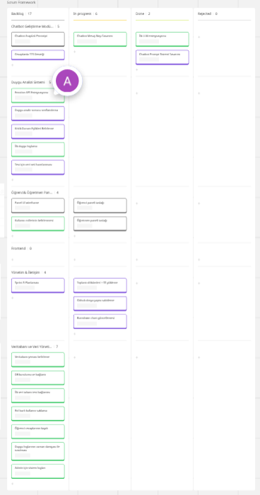  
- 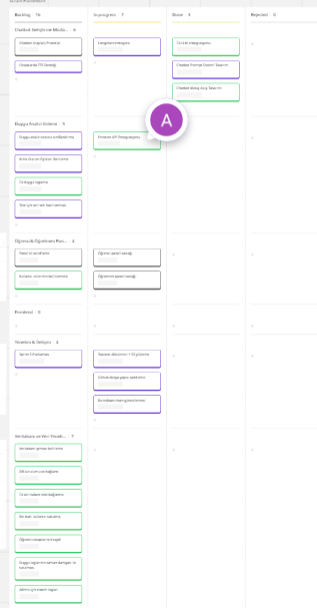  
- 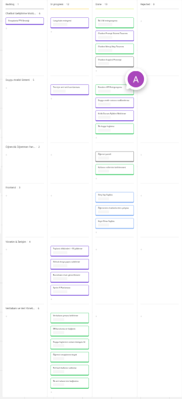
- 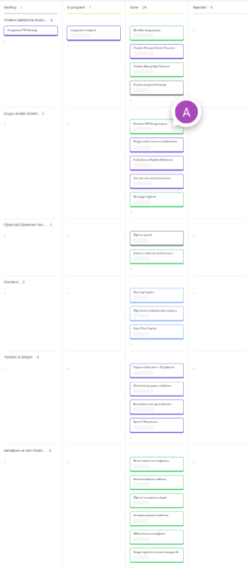

**🖼️ UI ve Chatbot Ekranları**  
- 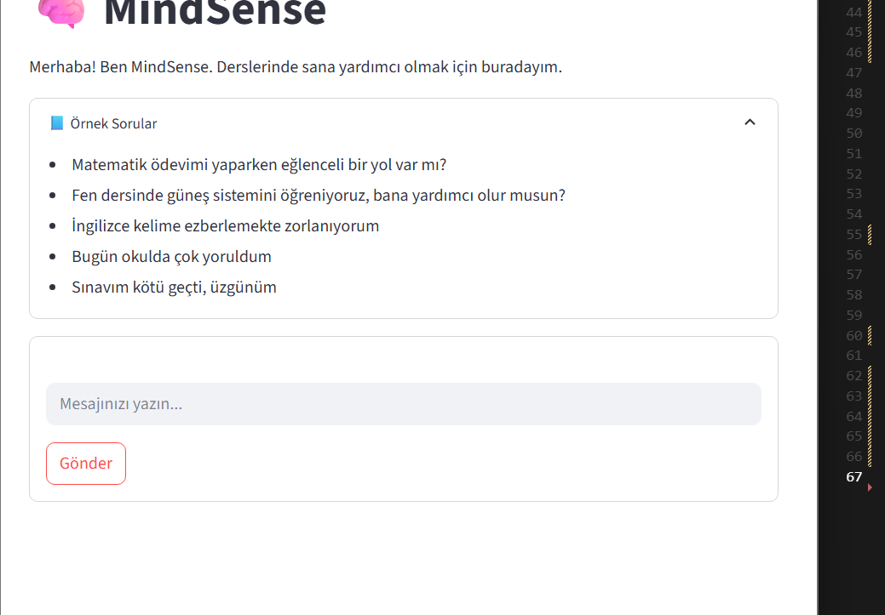  
- 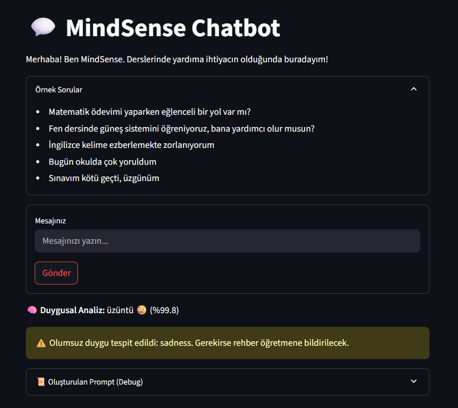  

#### Veritabanı Şeması
- 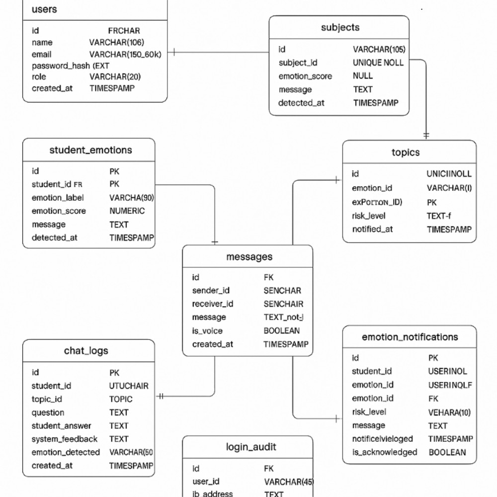
- 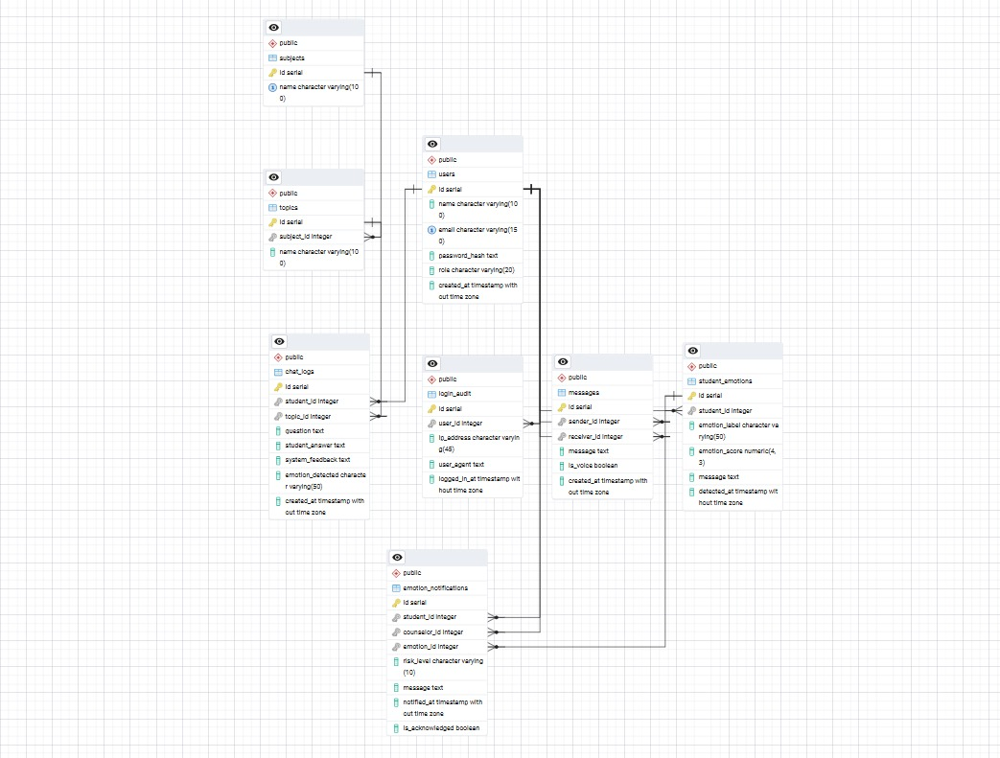

#### Öğrenci Paneli
- 🖼️ 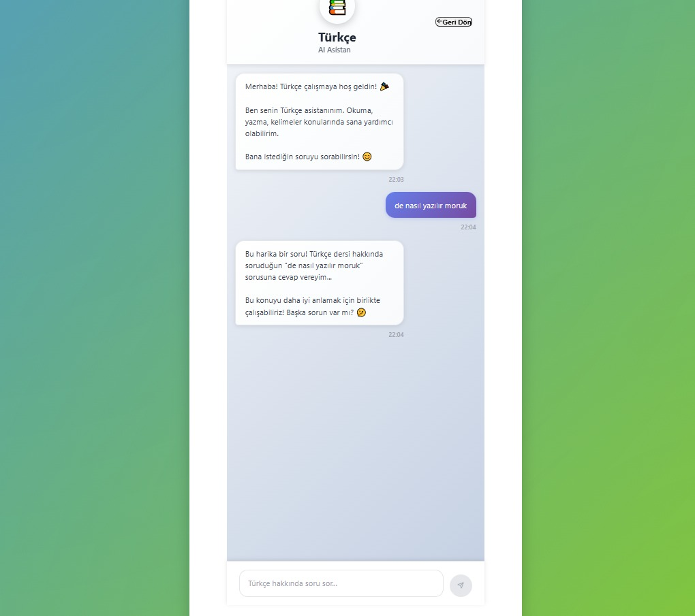
- 🖼️ 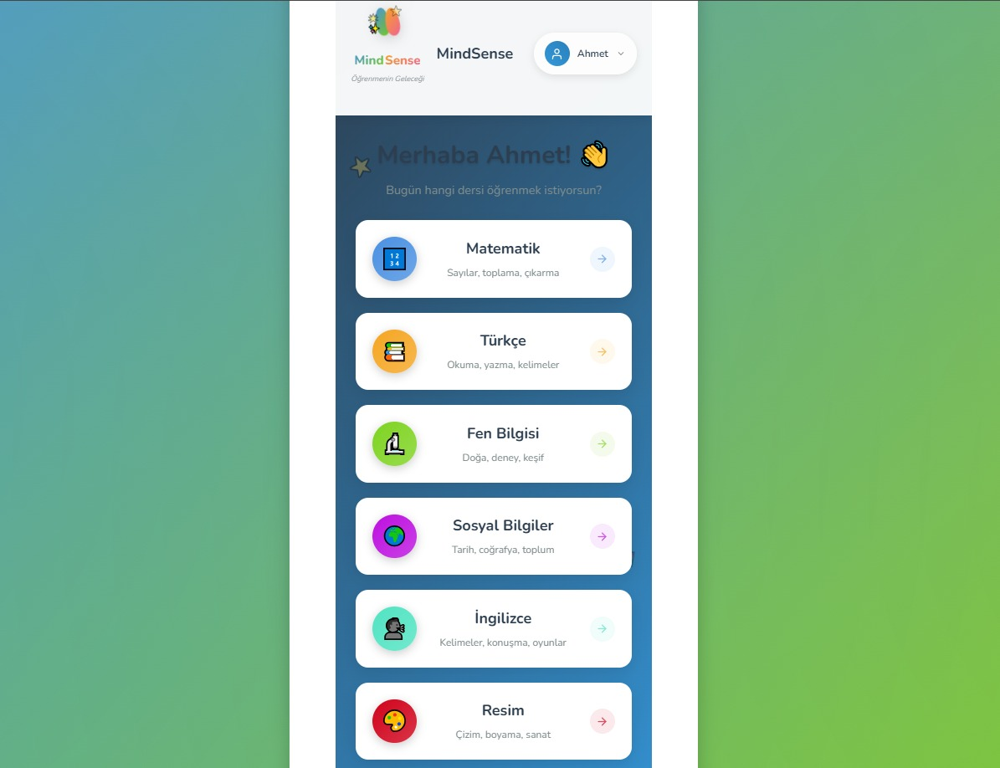
- 🖼️ 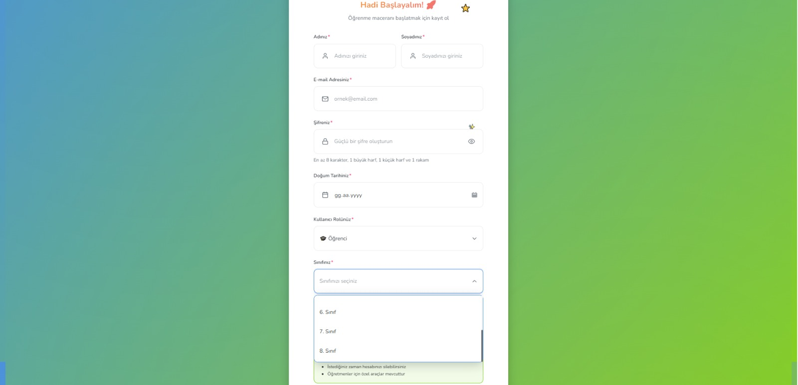

#### Öğrenci Anket ve Sesli Etkileşim
- 🖼️ 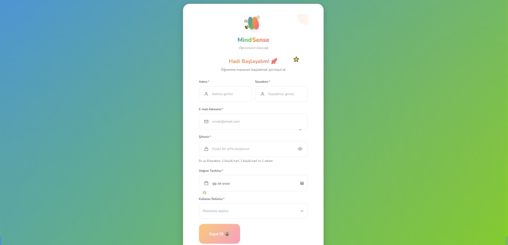
- 🖼️ 

#### Öğretmen Paneli
- 🖼️ 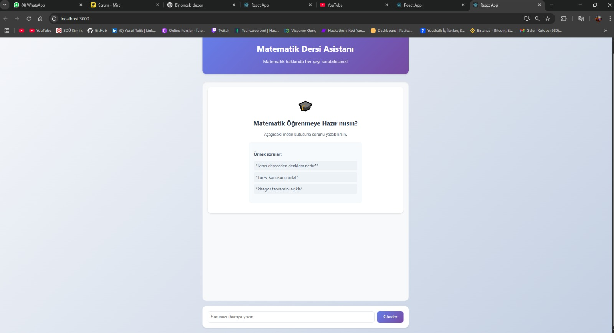

**🗨️ WhatsApp Görev Paylaşımları**  
-   
- 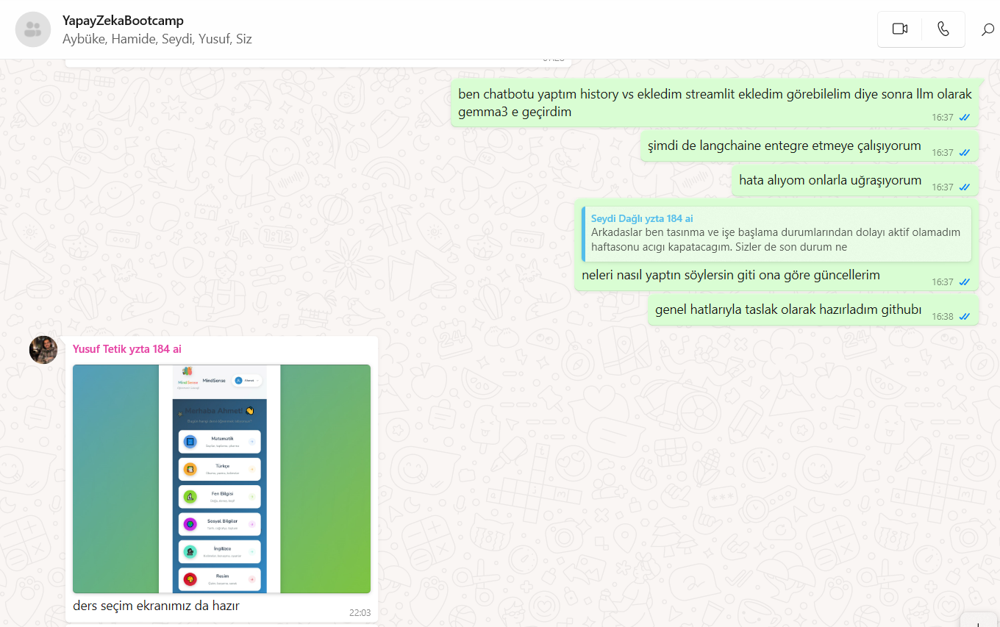  
- 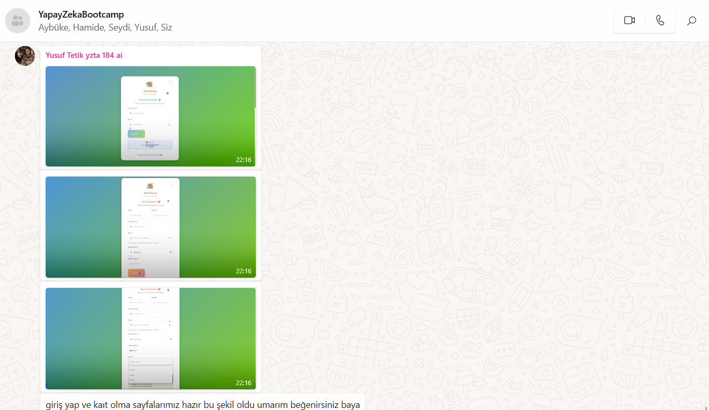

**💻 Toplantı Kayıtları**  
- 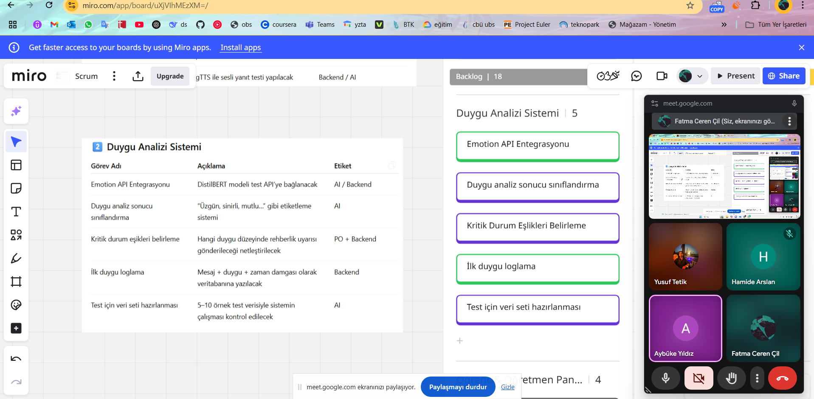  
- 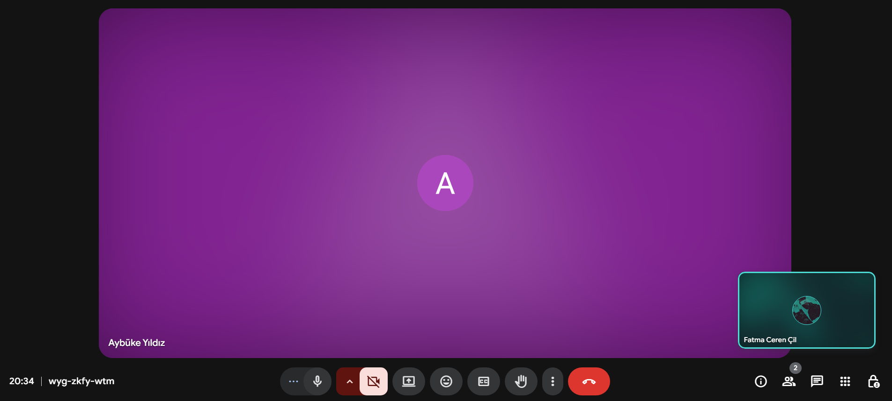

</details>


### Sprint 2 Değerlendirmesi

Sprint 2 sonunda sistemin ilk tam çalışan iskeleti ortaya çıkarılmış, öğrenci mesajlarının işlenmesi, duygusal analizden geçmesi ve uygun yanıtın chatbot tarafından verilmesi başarıyla gerçekleştirilmiştir. Öğretmen ve öğrenci arayüzlerinin tüm temel ekranları tamamlanmış; backend ve veritabanı tarafı da üretim düzeyinde çalışabilir hale getirilmiştir.

Sprint boyunca ekip disiplinli, koordine ve planlı bir şekilde ilerlemiştir. Geliştirme çıktılarının tamamı hem görseller hem dosyalar halinde belgelenmiştir.

Aşağıda takımın performansını değerlendiren bir tablo yer almaktadır:

<details>
<summary><strong>🔍 Sprint 2 Görev Bazlı Skorlama Tablosu</strong></summary>

### 📊 Görev Bazlı Performans Tablosu

#### 🧠 Duygu Analizi Sistemi

| Modül                 | Görev                           | Durum | Açıklama                                                           | Puan |
|-----------------------|----------------------------------|-------|--------------------------------------------------------------------|------|
| Duygu Analizi Sistemi | Test için veri seti hazırlanması | ✅    | Örnek cümleler ve duygu senaryoları oluşturuldu.                  | 5    |
|                       | Emotion API Entegrasyonu         | ✅    | DistilBERT modeli ile duygu API’si başarıyla kuruldu.             | 5    |
|                       | Duygu Analizi Sınıflandırması    | ✅    | Anger, sadness vb. etiket sistemi geliştirildi.                   | 5    |
|                       | Kritik Durum Eşikleri            | ✅    | Risk seviyeleri (düşük–orta–yüksek) sınıflandırıldı.              | 5    |
|                       | Duygu Loglama                    | ✅    | Timestamp’li duygu kaydı başarıyla oluşturuldu.                   | 5    |

#### 👨‍🏫 Öğrenci & Öğretmen Paneli

| Modül                  | Görev             | Durum | Açıklama                                                    | Puan |
|------------------------|-------------------|-------|-------------------------------------------------------------|------|
| Öğrenci & Öğretmen Paneli | Öğrenci Paneli    | ✅    | Giriş, kayıt, anasayfa gibi tüm bileşenler hazırlandı.      | 5    |
|                        | Kullanıcı Rolleri | ✅    | Öğrenci, öğretmen ve admin rolleri tanımlandı.              | 5    |

#### 🎨 Frontend

| Modül     | Görev                          | Durum | Açıklama                                                               | Puan |
|-----------|--------------------------------|-------|------------------------------------------------------------------------|------|
| Frontend  | Giriş Yap Sayfası              | ✅    | Öğrenci giriş sayfası tasarlandı (`Ekran görüntüsü.png`).             | 5    |
|           | Kayıt Olma Sayfası            | ✅    | Kayıt sayfası tamamlandı.                                              | 5    |
|           | Öğrencinin Chatbot ile Etkileşimi | ✅ | Chat ekranı aktif ve kullanılabilir durumda.                          | 5    |

#### 🗃️ Veritabanı & Veri Yönetimi

| Modül                    | Görev                        | Durum | Açıklama                                                                 | Puan |
|--------------------------|------------------------------|-------|--------------------------------------------------------------------------|------|
| Veritabanı & Veri Yönetimi | Veritabanı Şeması            | ✅    | `users`, `chat_logs`, `emotion_logs` tabloları oluşturuldu.              | 5    |
|                          | DB Kurulumu ve Bağlantı      | ✅    | SQLite üzerinden bağlantılar kuruldu.                                    | 5    |
|                          | Timestamp ile Duygu Loglama  | ✅    | Tüm loglar zaman bilgisiyle kaydedildi.                                  | 5    |
|                          | Öğrenci Cevaplarının Kaydı   | ✅    | Mesaj verileri veritabanına başarıyla aktarıldı.                         | 5    |
|                          | Rol Bazlı Kullanıcı Saklama  | ✅    | Kullanıcı rolleri veritabanında ayrı tutuluyor.                          | 5    |
|                          | Test Amaçlı DB Kullanımı     | ✅    | İlk test bağlantıları başarıyla çalıştırıldı.                            | 5    |

#### 🗂️ Yönetim & Belgeler

| Modül              | Görev                      | Durum | Açıklama                                                                 | Puan |
|--------------------|----------------------------|-------|--------------------------------------------------------------------------|------|
| Yönetim & Belgeler | Toplantı Görselleri + Döküm| ✅    | `Toplantı1.png`, `Toplantı2.png`, `Whatsapp1-3.png` yüklendi.            | 5    |
|                    | GitHub Dosya Yapısı        | ✅    | `docs/sprint2/` klasörü ve içerikler düzenlendi.                         | 5    |
|                    | Burndown Chart             | ✅    | Miro planlamaları `Miro1.png` üzerinden belgelenerek yüklendi.           | 5    |
|                    | Sprint 3 Planlaması        | ✅    | Yeni görevler `Miro2.png`, `Miro3.png`, `Miro4.png` görselleriyle eklendi.| 5    |

#### 🤖 Chatbot Geliştirme Modülü

| Modül                | Görev                         | Durum | Açıklama                                                               | Puan |
|----------------------|--------------------------------|-------|------------------------------------------------------------------------|------|
| Chatbot Modülü       | Langchain Entegrasyonu         | ⚠️    | Pipeline başlatıldı, ancak bazı hafıza/prompt detayları eksik.         | 3    |
|                      | Chatbot Prompt Sistemi         | ✅    | Duygusal bağlam içeren prompt sistemi hazırlandı.                      | 5    |
|                      | Chatbot Mesaj Akışı            | ✅    | Hafıza ve akış sistemi oluşturuldu.                                    | 5    |
|                      | Chatbot Arayüzü Prototipi      | ✅    | Streamlit ile chatbot ekranı çalışır hâlde geliştirildi (`Chatbot Streamlit.png`). | 5    |
|                      | TTS Desteği                    | ❌    | Sprint 3'e ertelendi.                                                  | 0    |

---

### ✅ Sprint 2 Toplam Skor

| Kategori                  | Görev Sayısı | Maks. Puan | Alınan Puan |
|---------------------------|--------------|------------|-------------|
| Duygu Analizi Sistemi     | 5            | 25         | 25          |
| Öğrenci & Öğretmen Paneli| 2            | 10         | 10          |
| Frontend                  | 3            | 15         | 15          |
| Veritabanı Yönetimi       | 6            | 30         | 30          |
| Yönetim & Belgeler        | 4            | 20         | 20          |
| Chatbot Modülü            | 5            | 25         | 18          |
| **TOPLAM**                | **25**       | **125**    | **118**     |

</details>


**Neler İyi Gitti?**
- Chatbot modülü tamamen çalışır hâle getirildi.
- Duygu analiz sistemi sınıflandırma, eşik belirleme ve loglama olarak eksiksiz kuruldu.
- Öğrenci ve öğretmen arayüzlerine ait tüm temel ekranlar net ve kullanılabilir şekilde tasarlandı.
- Takım içi iletişim, WhatsApp ve Meet üzerinden sürekli sürdürüldü.
- GitHub yapısı, dosya düzeni ve issue takibi optimize edildi.
- Veritabanı yapısı sade ve genişlemeye açık biçimde tasarlandı.

**Neler Geliştirilebilir?**
- TTS entegrasyonu planlandı ancak geliştirilemedi.
- UI ekranlarında detaylı bileşenlerin (animasyon, geri bildirim sistemi) Sprint 3'e bırakılması gerekti.


### Sprint 2 Retrospective

- TTS modülünün entegre edilmesi (Chatbot’un sesli yanıt verebilmesi)
- Öğrencinin duygu skorlarına göre öğretmene bildirim sisteminin kurulması
- UI bileşenlerinin detaylandırılması (modal, pop-up, toast, animasyonlar)
- Öğretmen panelinde geçmiş analiz verilerine göre sıralama ve filtreleme eklenmesi
- Kullanıcı testleri için senaryo oluşturulması ve pilot denemelerin başlatılması
</details>
<details>
<summary><strong> Kurulum Talimatları</strong></summary>

```bash
# 1. Repoyu klonlayın
git clone https://github.com/Yusuf-Tetik/YapayZekaAkademi.git
cd YapayZekaAkademi

# 2. Sanal ortam oluşturun ve etkinleştirin
python -m venv venv
source venv/bin/activate  # Windows için: venv\Scripts\activate

# 3. Gereksinimleri yükleyin
pip install -r requirements.txt

# 4. Backend sunucusunu çalıştırın
cd backend
uvicorn main:app --reload
</details>
